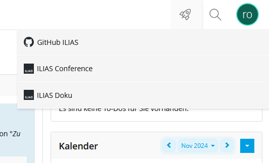
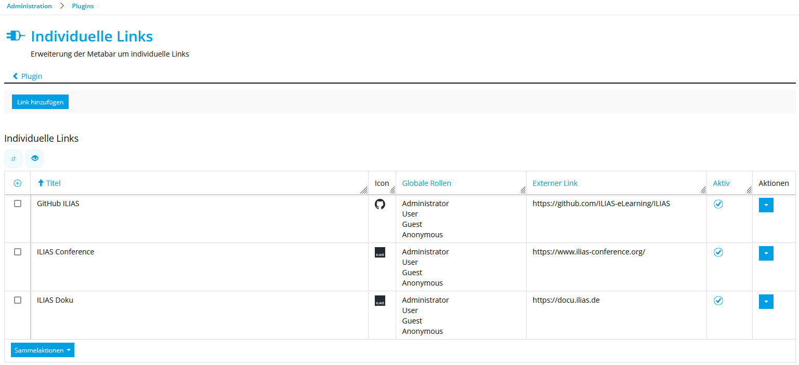
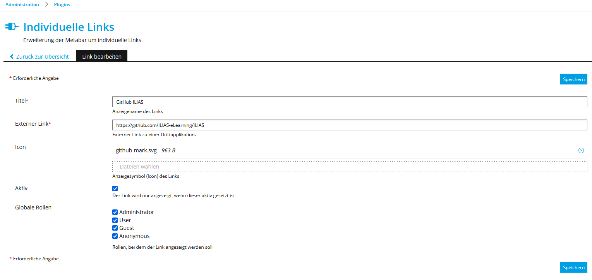

# CustomMetaBarLinks ILIAS Plugin

### University of Cologne | Competence Center E-Learning
#### Nadimo Staszak

## Core Features

- **Customizable MetaBar Links**  
  Display individual links directly in the MetaBar.

- **Link Management via Plugin Configuration**  
  Easily add, edit, or remove custom links through the plugin settings.

- **Role-Based Link Display**  
  Control the visibility of links by filtering based on global roles.

- **On-Demand Link Activation**  
  Enable or disable links as needed for flexible functionality.

- **Optional Icon Assignment**  
  Assign custom icons to links for enhanced visual representation.

## Overview

### Custom MetaBar Menu
<div style="text-align: center;">
    
</div>

### Custom MetaBar Links Overview


### Custom MetaBar Link Editing



## Installation

### Install via ZIP
1. Navigate to the root directory of your ILIAS installation.
2. Ensure that the downloaded plugin `cmbl.zip` is in your `~/Downloads` folder (adjust the path if necessary).
3. Run the following commands:
```bash
mkdir -p Customizing/global/plugins/Services/UIComponent/UserInterfaceHook/CustomMetaBarLinks
cd Customizing/global/plugins/Services/UIComponent/UserInterfaceHook/CustomMetaBarLinks
mv ~/Downloads/cmbl.zip cmbl.zip
unzip cmbl.zip
unlink cmbl.zip
```
4. Navigate back to the root directory of your ILIAS installation. 
5. Update dependencies using Composer:
```bash
composer du
```
6. Update and activate the plugin in the ILIAS Plugin Administration interface.

### Install via Git
1. Navigate to the root directory of your ILIAS installation.
2. Run the following commands to clone the plugin repository:
```bash
mkdir -p Customizing/global/plugins/Services/UIComponent/UserInterfaceHook
cd Customizing/global/plugins/Services/UIComponent/UserInterfaceHook
git clone https://github.com/cce-uzk/CustomMetaBarLinksPlugin.git CustomMetaBarLinks
```
3. Navigate back to the root directory of your ILIAS installation.
4. Update dependencies using Composer:
```bash
composer du
```
5. Update and activate the plugin in the ILIAS Plugin Administration interface.


## Update
To update the plugin:
1. Navigate to the root directory of your ILIAS installation.
2. Navigate to the plugin directory:
```bash
cd Customizing/global/plugins/Services/UIComponent/UserInterfaceHook/CustomMetaBarLinks
```
3. Pull the latest changes from Git:
```bash
git pull
```
4. Navigate back to the root directory of your ILIAS installation.
5. Update dependencies using Composer:
```bash
composer du
```
6. Update and activate the plugin in the ILIAS Plugin Administration interface.

## Requirements
* **ILIAS**: Version 9.0 - 9.999
* **PHP**: Version 8.1 or higher
  
